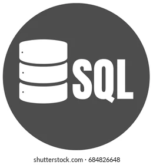

### My name is Alexander and I'm **open for new opportunities!**

I am a Full Stack Quality Assurance Engineer (both Auto / Manual)   
with 7+ years of automation commercial experience  
in web, mobile (iOS / Android), APIs and Databases.

### 🧭 Contacts:  
-  

### 🐊 Pet projects with detailed documentation:
- [Web UI tests](https://github.com/AlexanderVaraksa/demo_ui_tests)
- [API tests](https://github.com/AlexanderVaraksa/demo_api_tests)

### 🛠️ My stack and tools
Python, Robot framework, Selenium, selene, pytest, Jenkins, PyCharm, requests,   
Allure Report, Allure TestOps, Jira, GitHub, SQL, selenoid, Postman, Swagger, Appium etc

  

<a href="https://www.atlassian.com/software/jira">

---------------

---------------------------------

